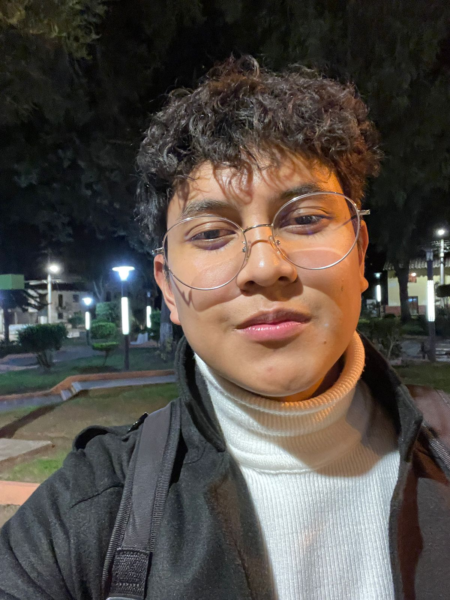
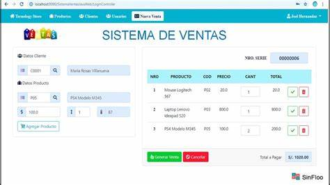
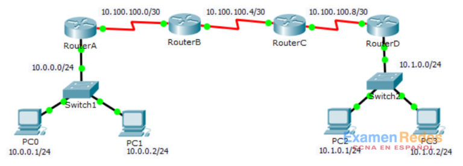
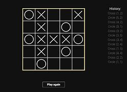

# Pagina

#  DOCTYPE html>
<html lang="es">
<head>
    <meta charset="UTF-8">
    <meta name="viewport" content="width=device-width, initial-scale=1.0">
    <title>Bienvenidos a pa pagina Web</title>
   

    <link rel="stylesheet" href="style.css">
    
</head>
<body>
    <header>
        <h1>Correa A. Francisco Adrian</h1>
        
    </header>
    <nav>
        <ul>
            <li><a href="https://github.com/afca2002" target="_blank">Visita mi perfil de GitHub</a></li>
            <li><a href="#proyectos">Preparacion Academica</a></li>
            <li><a href="#intereses">Intereses</a></li>
            <li><a href="#proyectos">Proyectos</a></li>
            <li><a href="#habilidades">Habilidades</a></li>
           
        </ul>
    </nav>

    <section id="Perfil">
        <h2>Perfil</h2>
        
Mi nombre es Francisco y soy estudiante de cuarto semestre de Ingeniería en Sistemas en la Escuela Politecnica del Ecuador. Desde que era niño, me apasionaba la tecnología y la idea de crear soluciones que facilitaran la vida de las personas. Durante mis estudios,he realizado en grupos  proyectos de curso  de algunas asignaturas , donde he desarrollado habilidades en programación, Base De Datos y Redes de conectividad.

        
Actualmente, estoy trabajando en algunos proyecto de curso sobre la estuctura de datos, Metodos Numericos, Multiprocesamientos entre otros.Mi objetivo profesional es especializarme en el la Ciberseguridad o en la Inteligencia Artificial y contribuir a la innovación tecnológica.

    </section>

    
    <section id="intereses">
        <h2>Intereses</h2>
        <ul>
            <li><strong>Deporte favorito:</strong> Fútbol</li>
            <li><strong>Comida favorita:</strong> Encebollado</li>
            <li><strong>Carrera:</strong> Ingeniería en Ciencias de la computacion</li>
            <li><strong>Pasatiempos:</strong> Programar, leer sobre tecnología y Tocar Guitarra</li>
        </ul>
    </section>
    <section id="Preparacion Academica">
        <h2>Preparacion Academica</h2>
        <ul>
            <li><strong>Escuela: </strong> Lilo Linke</li>
            <li><strong>Colegio:</strong> Replica Juan Pio Montufar</li>
            <li><strong>Bachillerato:</strong> Replica Juan Pio Montufar</li>
            <li><strong>Unversidad:</strong> Escuela Politecnica Nacional (En curso)</li>
        </ul>
    </section>
    <section id="proyectos">
        <h2>Proyectos</h2>
        <ul>
        <strong>Proyecto de Sistema De Ventas: </strong>
           este proyecto contiene un sistema de ventas que incluye categorias y utilizando el sisteme gestor de MySQL, el codigo fue realizado en java
            <a href="ProyectoBimestralSistemaDeVentas.zip" download>Descargar ZIP</a>
            
 

      
        
 <strong>Proyecto de Redes Y Conectividad: </strong>
         este proyecto contiene un el pkt del proyecto de coneccion de redes mediante el progrma Packet Tracer
         <a href="proyectoConectividadRedes.zip" download>Descargar ZIP</a> 

         

         
 <strong>Proyecto de Conversion a IEEE 754: </strong>
         este proyecto contiene un programa realizado en java, fue creado mediante la consola de ubuntu , parami fue un gran desafio a tener que investigar como funciona Ubuntu con los comandos, creamos los pdfs con latex y Emacs, como objetivo tiene transformar cualquier numero decimal a su forma IEEE 754
         <a href="ExamenBimestral_ConversionNumeroHexadecimal.zip" download>Descargar ZIP</a> 

         
            
         
 <strong>Proyecto deL Juego TIC TAC TOE </strong>
         Este proyecto es un juego realizado en MatLab , tambien llamado 4 en raya y su obejtivo era que se logre conecat con otra computadora para que los algoritos jueguen entre si, gracias al    <a  href="https://laboratorio-ia.epn.edu.ec/en/members-h/35-dr-marco-benalcazar" target="_blank">Doc. Marco Benalcazar</a>  que nos facilito un algoritmo de base , logramos completar el proyecto con exito
        <a href="ProyectoTIC-TAC-TOE.zip" download>Descargar ZIP</a> 

        
<a href="ProyectoTIC-TAC-TOE.zip" download>Descargar ZIP</a> 

         
       
        

        </ul>
    </section>
    <section id="habilidades">
        <h2>Habilidades</h2>
        <ul>
            <li><strong>Lenguajes de programación:</strong> Python, Java, C++</li>
            <li><strong>Desarrollo web:</strong> HTML, JavaScript</li>
            <li><strong>Bases de datos:</strong> MySQL</li>
            <li><strong>Herramientas de desarrollo:</strong>  Visual Studio Code</li>
            <li><strong>Otras habilidades:</strong> Análisis de datos, resolución de problemas y trabajo en equipo</li>
        </ul>
    </section>
    <footer>
        
© 2024 Francisco A. Correa A . Gracias Por su visita

    </footer>
</body>
</html>

